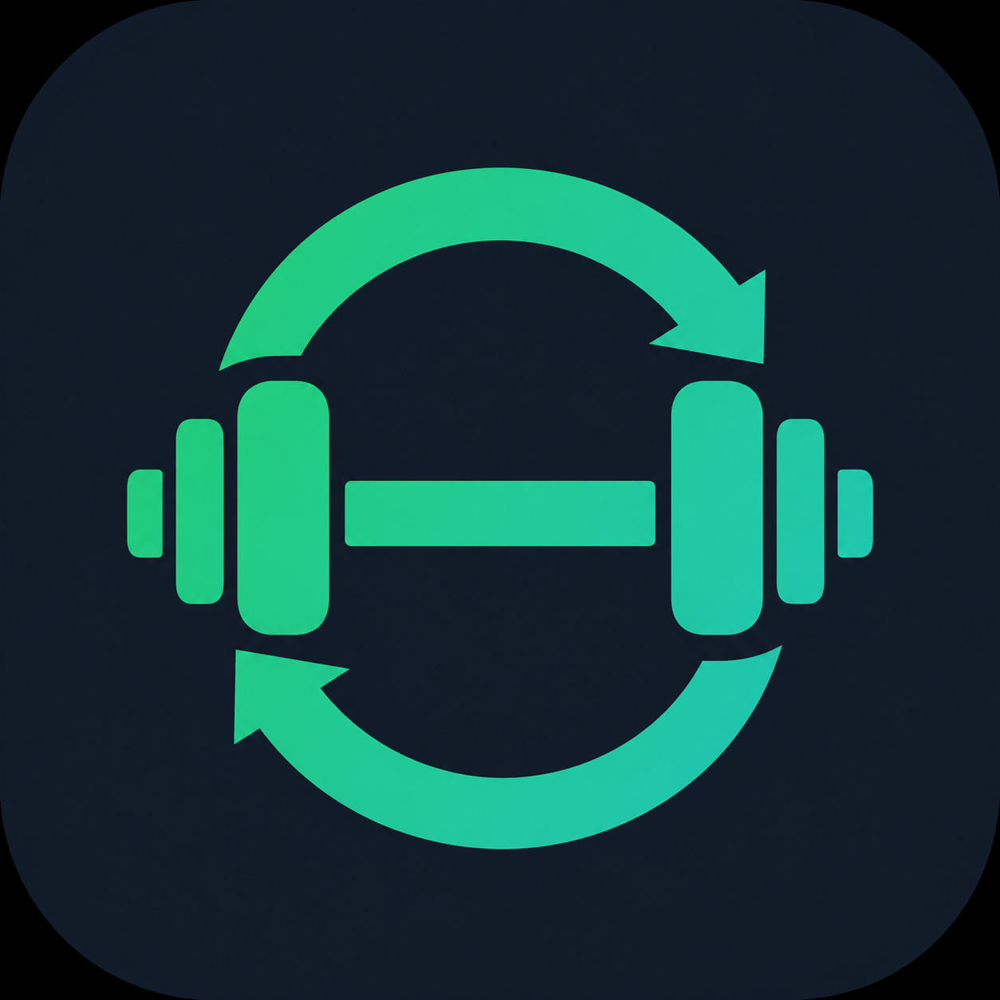

<div align="center">

[](README.es.md)



# 🏋️ FitRoutine

### Your personal workout routine manager

A mobile-first web app for creating, managing, and tracking your workout routines.

Built with **React**, **Express**, **TypeScript**, and **SQLite**.

[](https://react.dev)
[](https://www.typescriptlang.org)
[](https://expressjs.com)
[](https://www.prisma.io)
[](https://www.sqlite.org)

</div>

---

## ✨ Features

- 📋 **Create & manage routines** — Build custom workout routines with ease
- 🏋️ **Exercise library** — Categorized exercises with muscle groups and equipment
- ⚙️ **Full customization** — Sets, reps, weight, rest time, and notes per exercise
- 📱 **Mobile-first design** — Works great on your phone
- 📊 **Workout history** — Track your progress over time
- 🎨 **Multiple themes** — Dark, Light, and Sunset
- 🌐 **Multi-language** — English and Spanish support
- 📲 **QR code access** — Scan to open on your phone instantly
- 💾 **Local-first** — All data stays on your machine, no cloud required

---

## 🚀 Quick Start

### Prerequisites

You only need **Node.js** installed on your computer.

| Required | Version |
|----------|---------|
| [Node.js](https://nodejs.org) | 18+ (LTS recommended) |

> 💡 To check if you have Node.js installed, open a terminal and run:
> ```bash
> node --version
> ```

### Installation

**1. Clone the repository**

```bash
git clone https://github.com/RodrigoIGO1600/FitRoutine-local.git
cd FitRoutine-local
```

**2. Run the start script for your OS**

<details>
<summary><strong>🪟 Windows</strong></summary>

Double-click the `start.bat` file, or run in terminal:

```bash
.\start.bat
```

</details>

<details>
<summary><strong>🍎 macOS</strong></summary>

Double-click the `start.command` file, or run in terminal:

```bash
./start.command
```

</details>

<details>
<summary><strong>🐧 Linux</strong></summary>

```bash
./start.sh
```

</details>

That's it! The script will automatically:
- ✅ Check that Node.js is installed
- ✅ Install all dependencies (first time only)
- ✅ Set up the database with Prisma migrations
- ✅ Start the backend on port `3000`
- ✅ Start the frontend on port `5173`
- ✅ Open the app in your browser
- ✅ Show a QR code to access from your phone

### Manual Setup

If you prefer to run each step yourself:

```bash
# Install backend dependencies
cd backend
npm install

# Set up the database
npx prisma migrate dev

# Go back to root
cd ..

# Install frontend dependencies
cd front
npm install

# Go back to root
cd ..

# Start both servers
npm run dev
```

Then open **http://localhost:5173** in your browser.

---

## 🏋️ How to use FitRoutine

### Step 1: Create exercises

Before building routines, you need exercises in your library.

1. From the home screen, tap the **pencil icon** (✏️) in the top-right corner
2. Fill in the exercise details:

| Field | Required | Description |
|-------|----------|-------------|
| **Name** | ✅ | e.g. "Bench Press", "Squats" |
| **Video URL** | ✅ | Link to a YouTube tutorial |
| **Muscle Group** | ✅ | Shoulders, Chest, Back, Biceps, Triceps, Forearm, Traps, Legs, Glutes, Core |
| **Category** | ✅ | Strength, Cardio, Mobility, Stretching |
| **Equipment** | ✅ | Bodyweight, Dumbbell, Barbell, Machine, Kettlebell, Band, Cable, Other |
| **Timed** | ❌ | Toggle ON for exercises based on time (e.g. planks, holds) |
| **Description** | ❌ | Any additional notes |

3. Tap **Save** — you're done!

> 💡 **Tip:** Create all the exercises you need first. It makes building routines much faster.

### Step 2: Create a routine

1. From the home screen, tap the **"+ Create Routine"** button at the bottom
2. Enter a **name** (e.g. "Push Day", "Full Body") and an optional description
3. Tap **Create**

### Step 3: Add exercises to your routine

1. Tap on the routine card to open it
2. Tap **"+ Add Exercise"** at the bottom
3. Browse or search your exercise library
4. Select the exercises you want (they get highlighted)
5. Close the exercise sheet

### Step 4: Configure each exercise

For each exercise in your routine, you can customize:

| Setting | Default | What it does |
|---------|---------|--------------|
| **Sets** | 3 | Number of sets to perform |
| **Reps** | 10 | Repetitions per set (or 1 for timed exercises) |
| **Duration** | 30s | Time in seconds (only for timed exercises) |
| **Rest** | 90s | Rest time after completing all sets |
| **Rest between** | 60s | Rest time between sets |

- **Drag** the exercise cards to reorder them
- Tap the **edit icon** on any exercise to change its settings
- Tap **remove** to delete an exercise from the routine

### Step 5: Save your routine

Tap **Save** in the top-right corner. Your routine is ready!

### Step 6: Start a workout

1. From the home screen, tap on your routine
2. Tap **Start Workout**
3. Complete each set and mark it as done
4. The app tracks your duration, total sets, reps, and volume
5. When finished, your workout is saved to **History**

---

## 📱 Use from your phone

When the app is running, the start script displays a **QR code** in the terminal.

1. Make sure your phone is connected to the **same WiFi** as your computer
2. Scan the QR code with your phone's camera
3. The app opens in your mobile browser — ready to use at the gym!

---

## 🛠️ Tech Stack

| Layer | Technology |
|-------|-----------|
| **Frontend** | React 19, Vite, TypeScript, React Router |
| **Backend** | Node.js, Express 5, TypeScript |
| **Database** | SQLite via Prisma ORM |
| **Styling** | CSS Modules, mobile-first design |
| **Icons** | Iconify |

---

## 📁 Project Structure

```
FitRoutine-local/
├── backend/
│   ├── prisma/          # Database schema & migrations
│   ├── src/
│   │   ├── routes/      # API endpoints
│   │   ├── controllers/ # Request handlers
│   │   ├── services/    # Business logic
│   │   └── db/          # Database client
│   └── package.json
├── front/
│   ├── src/
│   │   ├── api/         # HTTP client functions
│   │   ├── components/  # Reusable UI components
│   │   ├── pages/       # Page views
│   │   ├── context/     # Theme & language providers
│   │   ├── i18n/        # Translations
│   │   └── types/       # TypeScript types
│   └── package.json
├── start.bat            # Quick start for Windows
├── start.command        # Quick start for macOS
├── start.sh             # Quick start for Linux
└── package.json         # Root scripts
```

---

## 🔧 Available Scripts

| Script | Description |
|--------|-------------|
| `start.bat` / `start.command` / `start.sh` | Start everything with one click |
| `npm run dev` | Start both frontend and backend |
| `npm run dev:back` | Start only the backend |
| `npm run dev:front` | Start only the frontend |

---

## 📄 License

This project is open source and available for anyone to use and learn from.

---

<div align="center">

**Built as a learning project to practice fullstack development**

⭐ Star this repo if you find it useful!

</div>
