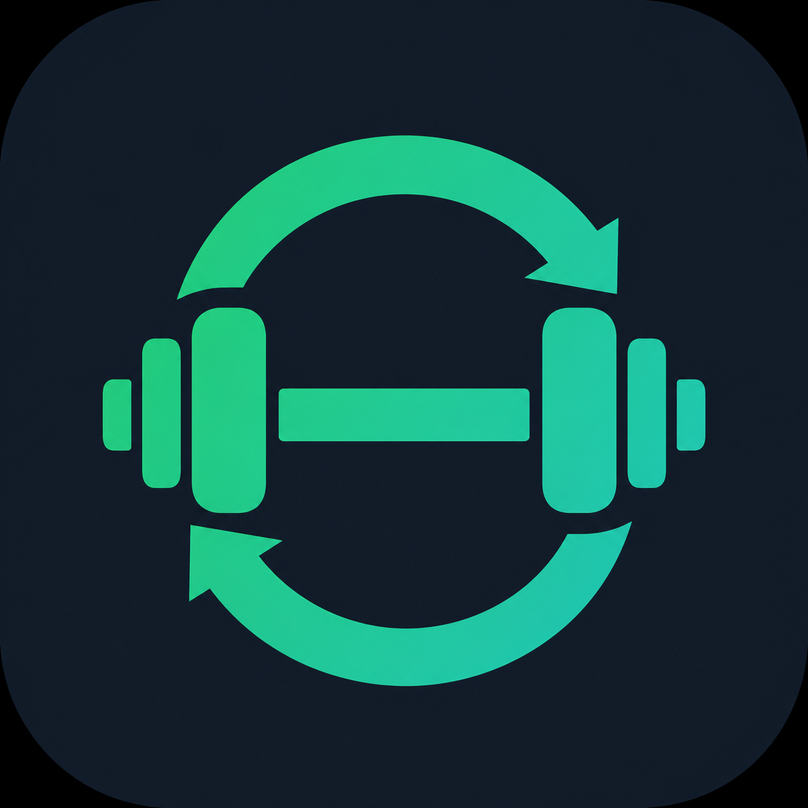

<div align="center">

[](README.es.md)



# 🏋️ FitRoutine

### Full-stack, mobile-first workout management application

Create, organize, and track training routines locally.

[](https://react.dev)
[](https://www.typescriptlang.org)
[](https://expressjs.com)
[](https://www.prisma.io)
[](https://www.sqlite.org)

</div>

---

## ✨ Overview

FitRoutine is a full-stack, mobile-first workout management application for creating, organizing, and tracking training routines. It is designed to run locally while allowing devices on the same network to interact with the application.

The application lets users build a personal exercise library, combine exercises into routines, and run guided workout sessions. Each exercise in a routine can be configured with sets, repetitions or duration, rest intervals, and notes. Started workouts are saved to a local history so users can review past sessions.

FitRoutine is built as a personal full-stack project to explore and implement local application behavior, modern React and TypeScript development, REST API design, responsive mobile-first UI, persistence and database design, and cross-device local-network usage. It is intentionally local-only: the SQLite database lives in the backend, and a phone on the same WiFi network acts only as a client.

---

## 🚀 Key Features

- 📋 **Routine creation and management** — create, update, and delete workout routines
- 🏋️ **Exercise library** — define exercises with muscle group, category, equipment, description, video URL, and timed/rep-based type
- ⚙️ **Routine builder** — add exercises to routines, configure sets/reps/duration/rest, and reorder exercises
- ▶️ **Active workout tracking** — start a routine, mark sets complete, run rest and exercise timers, and track elapsed time
- 📊 **Workout history** — save completed sessions and review total time, sets, and reps
- 📱 **Responsive/mobile-first UI** — optimized for phone use with a layout that also works on desktop
- 🎨 **Multiple themes** — dark, light, and sunset themes, persisted in local storage
- 🌐 **English/Spanish localization** — switch interface language, persisted in local storage
- 🌐 **Local-network access** — run the backend on `0.0.0.0` and open the frontend from other devices on the same network
- 📲 **QR code access** — desktop view displays a QR code that links to the local-network frontend URL

---

## 🛠️ Tech Stack

### Frontend

- React 19
- TypeScript
- Vite
- React Router 7
- CSS Modules
- Iconify React
- qrcode.react

### Backend

- Node.js
- Express 5
- TypeScript
- tsx

### Database

- SQLite
- Prisma 7 ORM

---

## 🏗️ Architecture

The project is organized into three top-level folders:

```txt
FitRoutine-local/
├── backend/          # Express API, Prisma schema, migrations
├── front/            # React frontend
└── docs/             # API contract and architecture notes
```

The frontend and backend run as separate local processes during development. The frontend does not access the database directly; it communicates with the backend through HTTP requests. The backend owns all persistence logic and stores data in a local SQLite file.

```txt
Browser (desktop or mobile)
  → React frontend
  → frontend API client (front/src/api/)
  → REST endpoints (backend/src/routes/)
  → controllers (backend/src/controllers/)
  → services (backend/src/services/)
  → Prisma (backend/src/db/)
  → SQLite
```

State on the frontend is managed with React hooks and contexts. A `ThemeProvider` and `LanguageProvider` supply theme and language state to the component tree. Workout progress is also persisted to `localStorage` during an active session so it can survive page reloads.

---

## 🔌 API / Data Flow

The frontend reads the API base URL from `VITE_API_URL` and falls back to `/api`:

```ts
export const API_URL = import.meta.env.VITE_API_URL ?? "/api";
```

Endpoint modules live in `front/src/api/` and wrap `fetch` calls. The backend exposes routes under `/api`:

- `GET /api/health` — health check
- `GET /api/network/ip` — returns the laptop's local IPv4 address
- `/api/exercises` — exercise CRUD
- `/api/routines` — routine CRUD
- `/api/workout-sessions` — workout session history
- `/api/routines/:id/exercises` and `/api/routine-exercises/:id` — routine-exercise management

Responses use a consistent JSON shape: `{ data: ... }` for success and `{ error: "..." }` for errors.

---

## 💻 Running Locally

### Prerequisites

- Node.js 18+ (LTS recommended)
- npm

### Quick start

<details>
<summary><strong>🪟 Windows</strong></summary>

```bash
.\start.bat
```

</details>

<details>
<summary><strong>🍎 macOS</strong></summary>

```bash
./start.command
```

</details>

The start script will install dependencies, apply Prisma migrations, start the backend on port `3000`, start the frontend on port `5173`, and open the app in your browser.

### Manual setup

```bash
# Root dependencies
npm install

# Backend dependencies and database
cd backend
npm install
npx prisma migrate deploy

# Frontend dependencies
cd ../front
npm install

# Run both servers from the project root
cd ..
npm run dev
```

Then open [http://localhost:5173](http://localhost:5173).

### Ports and environment

| Service  | Default URL                  |
|----------|------------------------------|
| Frontend | http://localhost:5173        |
| Backend  | http://localhost:3000        |
| API base | http://localhost:3000/api    |

Backend environment variables (see `backend/.env.example`):

```txt
PORT=3000
DATABASE_URL="file:./dev.db"
```

Frontend environment variables (see `front/.env.example`):

```txt
VITE_API_URL=http://localhost:3000/api
```

For local-network testing, set `VITE_API_URL` to the laptop's local IP, for example `http://192.168.1.75:3000/api`, and open the frontend using the same IP.

---

## 📝 Development Notes

- **Mobile-first responsive design** — components are styled primarily for phone screens and adapt to desktop via CSS Modules.
- **Separation of concerns** — backend logic is split into routes, controllers, and services; frontend data access is centralized in `front/src/api/`.
- **Centralized API access** — the API base URL is configured once in `front/src/api/client.ts` and reused by all endpoint modules.
- **TypeScript throughout** — both frontend and backend use TypeScript with typed API data shapes.
- **Prisma migrations** — schema changes are tracked in `backend/prisma/migrations/` and applied with `npx prisma migrate deploy`.
- **Custom internationalization** — translations are stored in `front/src/i18n/` and consumed through a React context hook.
- **Local-network access** — the backend binds to `0.0.0.0` and exposes `/api/network/ip` so the frontend can display the correct QR code URL.

---

## 🤖 AI-Assisted Development

AI-assisted development tools were used during parts of the implementation and iteration process. Project requirements, architecture, integration decisions, code review, debugging, and final implementation decisions remained under developer supervision.

---

## 📊 Project Status

FitRoutine is a personal full-stack project in active development. It is not a commercial product or production-grade service; it is intended for local use and as a portfolio example.

---

## 📄 License

This project is open source and available for anyone to use and modify.

---

<div align="center">

**Built as a personal full-stack learning project**

Give it a star if you found it useful!

</div>
